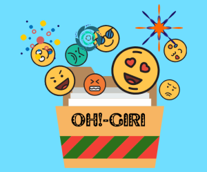
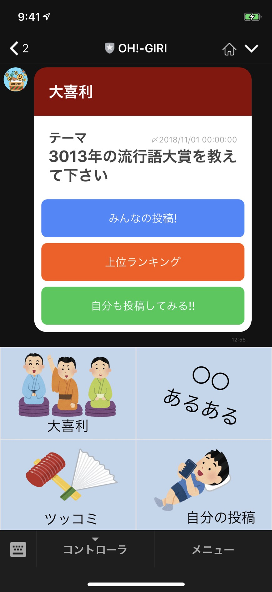

# OH!-GIRI

## 製品概要

### 大喜利 X Tech

### 背景（製品開発のきっかけ、課題等）

- 昨今のLINE Messaging APIの持つ機能は多種多様で, さらに高度なコミュニケーションが実現できる。

- だが店舗の案内や広告など,単方向なコミュニケーションで利用されることが多い.

- 単方向なコミュニケーションを行うLINE Botに比べMicrosoftが提供しているLINE Bot「りんな」など、双方向なコミュニケーションを行うLINE Botは、より知名度が高く利用者も多い．

- しかし、AIによって実現される双方向なコミュニケーションを行うLINE Botには限界がある．

- そこで、不特定多数の人間と双方向にコミュニケーションができるLINE Botは、より多くのユーザに利用にされるのではないかと考えた.

- 中でもAIでは実現ができない「ユーモアセンス」の部分を人間同士で評価し，競うことで新たなLINE Botの形を提案する．

### 製品説明（具体的な製品の説明）

このLINEBot製品「OH!-GIRI」では、以下を実現することが可能である。

- 画面下部にリッチメニューから大喜利のカテゴリを選択すること
- \[自分も投稿してみる!!\]ボタンを押し、運営側から与えられたテーマに対し、テキスト形式で回答すること
- \[みんなの投稿!\]や\[上位ランキング\]ボタンを押し、回答を確認すること
    - 他人の回答はランダムで表示される
    - 自分の回答も確認できる
- 他人の回答にイイね👍をつけること
- 多くイイねがついた回答をランキング表示すること

#### プロダクトのQRコード

### 特長

#### 1. 特長 1

- ユーザはLINEのアプリケーションのみで全てのコンテンツを楽しめる。

#### 1. 特長 2

- リッチメニューやクイックリプライを用いることで、従来のLINE Botの常識を覆すユーザビリティを実現。

#### 2. 特長 3

- LINEで完結する多くの見知らぬLINEユーザたちと大喜利を橋がけに笑いを共有・競争できる．

#### 3. 特長 4

- 不適切な投稿があった際,不適切なワードを伏せ字にすることで不快感を感じることなくサービスを楽しむことができる.

#### 4. 特長 5

- 日替わりで大喜利のイイね!👍数をランキング表示するため，競技性がある．

### 解決出来ること

- 日々の生活に笑いが増え、上手い大喜利の回答を見て自分のユーモアセンスが向上する．

### 今後の展望

- 自身の投稿の全体でのランキング化
- 過去の大喜利の殿堂入り作品の表示
- 自身の大喜利のうまさの評価を数値的指標で表示
- LINEClovaと連携した投稿読み上げ機能
- ユーザ毎の趣向を考慮した投稿リコメンド機能

## 開発内容・開発技術

### 活用した技術

#### API・データ

- goo 形態素解析 API
- LINE Messaging API

#### フレームワーク・ライブラリ・モジュール

- mongoDB
- heroku
- Node.js

#### デバイス

- iPhone
- MacBook Pro

### 研究内容・事前開発プロダクト（任意）

- 特になし

### 独自開発技術（Hack Day で開発したもの）

#### 2 日間に開発した独自の機能・技術

- FlexMessageとカルーセルコンテナを複合し、ユーザビリティを向上させた新たなUI
- LINE Messaging API を用いる際煩雑となる JSON を簡単に生成するためのビルダー
- NGWord辞書を用いたフィルタリング機能
